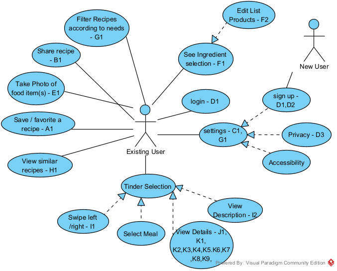
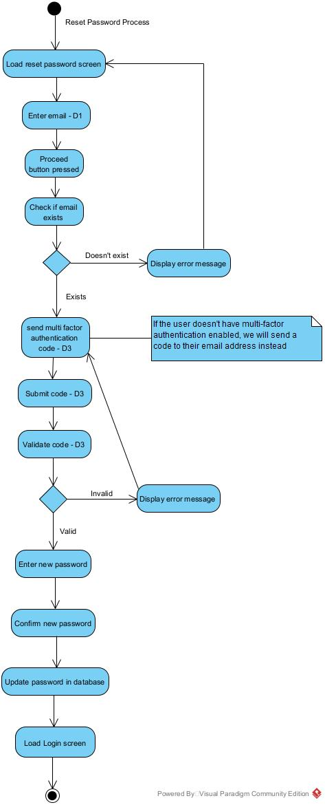
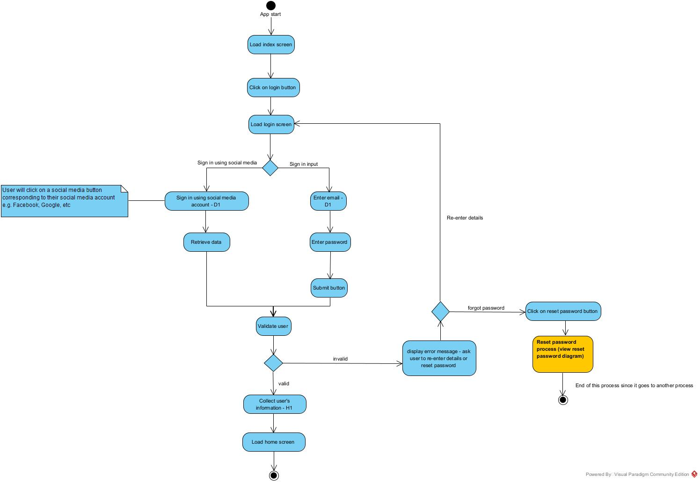
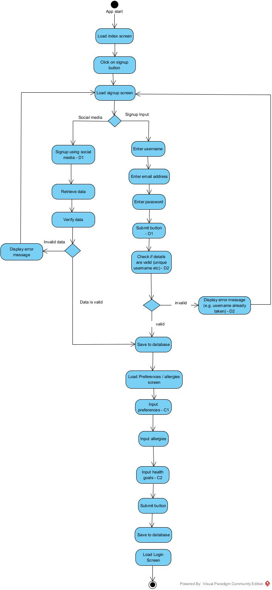
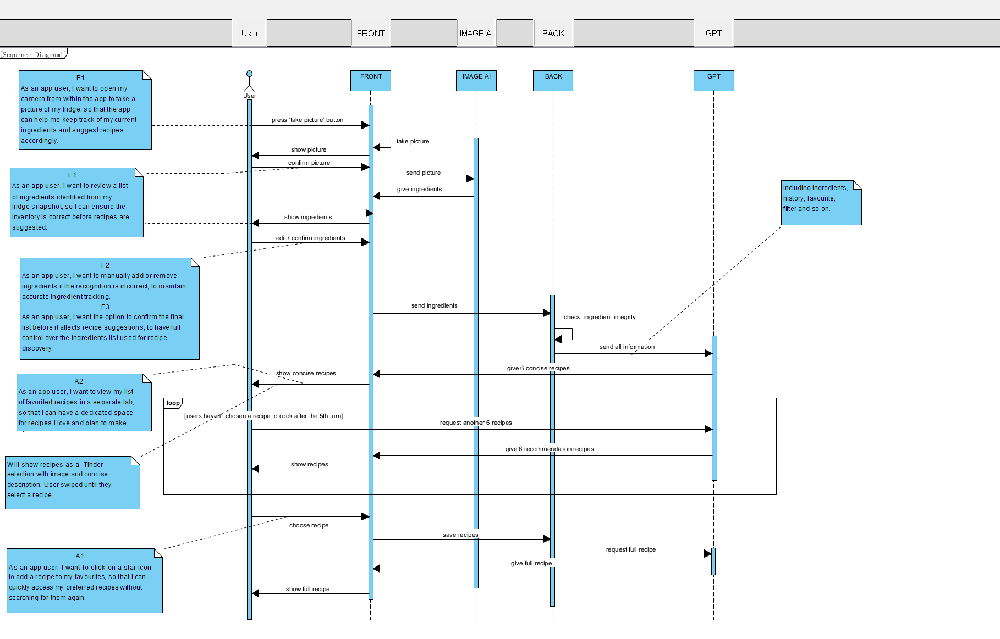

# Food AI Brief

## Introduction
**Team 31's Food AI Project**

Have you ever found yourself looking inside your fridge trying to figure out what to eat? Our Food AI project aims to deal with this age-old issue with generative AI packaged in an easy-to-use yet feature-rich mobile application.

**How it Works:**

Generate recipes that the user will like in only four simple steps:

1. Set up your preferences, allergies, etc., and tell the app what cooking equipment you have.

2. Take a photo of your fridge, and an image detection component will help identify possible ingredients.

3. Watch as recipes are generated for you.

4. Swipe left if you're not interested or swipe right if you're feeling hungry, and the recipe will be shown to you in its full glory.

**Goals:**

- User-friendly user interface
- Accessibility options and testing
- Recipe saving and organisation
- Safe, diverse, and high-quality recipes with detailed instructions and warnings
- Personalisation and fine-tuning of recipes and user settings
- Social media integration
- CI/CD

## User Stories
Below are the user stories that we will be using for our product backlog. We have given codes at the start of each user story so that they can be tracked across the various diagrams that we have made. At the end of each user story, there is also a rating which tells us how hard it will be to complete that specific task.

Favoriting Recipes

A1. As an app user, I want to click on a star icon to add a recipe to my favourites, so that I can quickly access my preferred recipes without searching for them again. - 1

A2. As an app user, I want to view my list of favourited recipes in a separate tab so that I can have a dedicated space for recipes I love and plan to make often. - 1

A3. As an app user, I want to be able to sort my favourited recipes by cuisine, cooking time, and other filters so that I can organise my favourites based on my current cooking preferences or time constraints. - 2

---
Sharing Recipes

B1. As an app user, I want to press a share button to send a recipe link via text, email, or social media so that I can easily share my culinary finds with friends and family.  - 3

B2. As an app user, I want to include a personal note or comment when sharing a recipe, to add a personal touch or specific thoughts when recommending the recipe to others. - 1

---
Settings Personalisation

C1. As an app user, I want to select dietary preferences in my profile settings (e.g., vegetarian, gluten-free) so that the recipes I browse are aligned with my dietary needs. - 1

C2. As an app user, I want to input my health goals (e.g., weight loss, muscle gain), so the app can recommend recipes that support my fitness and health objectives. - 1

---
Account Registration

D1. As an app user, I want to sign up using my email or social media accounts for quick registration to minimise the time and effort required to start using the app. - 1 

D2. As an app user, I want to choose a unique username for my profile on the app so I can be easily recognised by friends. - 1

D3. As an app user, I want to have a multi-factor authentication option for increased security to ensure my personal information and account details are well-protected.  - 1

---
Fridge Snapshot

E1. As an app user, I want to open my camera from within the app to take a picture of my fridge, so that the app can help me keep track of my current ingredients and suggest recipes accordingly. - 2

---
Ingredient Verification

F1. As an app user, I want to review a list of ingredients identified from my fridge snapshot so I can ensure the inventory is correct before recipes are suggested. - 2  

F2. As an app user, I want to manually add or remove ingredients if the recognition is incorrect to maintain accurate ingredient tracking. - 1

F3. As an app user, I want the option to confirm the final list before it affects recipe suggestions to have full control over the ingredient list used for recipe discovery. - 1

---
Customise Recipe Settings

G1. As an app user, I want to adjust my settings related to allergies, cooking times, difficulty levels, portion sizes, and required utensils so that I can receive recipe suggestions tailored to my specific needs and circumstances. - 1

---
Discover Similar Recipes

H1. As an app user, I want to see a "Similar Recipes" section on the homepage to explore new recipes that align with my taste preferences and expand my culinary repertoire. - 5

---
Meal/Tinder Selection

I1. As an app user, I want to swipe right or left to like or dislike meal options to quickly curate my meal plan and discover new recipes that match my taste. - 8

I2. As an app user, I want to see a thumbnail image of the recipe along with the title and a short description to make an informed decision while swiping through the options. - 8

---
Recipe Overview

J1. As an app user, I want to tap on the recipe overview to expand to a full description to better understand the dish before deciding to prepare it. - 2

---
Detailed Recipe Information

K1. As an app user, I want to have step-by-step instructions for each recipe so that I can follow along easily without missing any critical steps in the cooking process. - 1

K2. As an app user, I want a complete list of ingredients for each recipe so that I can ensure I have everything I need before starting to cook. - 1

K3. As an app user, I want to see a high-quality image of the finished dish for each recipe so that I know what the final product should look like and can be inspired by its presentation. - 1

K4. As an app user, I want to see a difficulty rating for each recipe so that I can choose recipes that match my cooking skill level. - 1

K5. As an app user, I want to see the estimated preparation and cooking time for each recipe so that I can manage my time effectively and choose recipes that fit my schedule. - 1

K6. As an app user, I want a list of required utensils for each recipe so that I can prepare my kitchen tools in advance and ensure I have the necessary equipment. - 1

K7. As an app user, I want to see allergen information for each recipe so that I can avoid dishes that contain ingredients I am allergic to. - 1

K8. As an app user, I want to know the portion sizes for each recipe so that I can plan meals according to the number of people I'm serving or for my own dietary needs. - 1

K9. As an app user, I want detailed nutritional information for each recipe so that I can track my dietary intake and choose recipes that align with my health goals. - 1

## Technologies
Firebase: Back-End Development
Firebase provides our app with a reliable and scalable back-end solution. It's ideal for managing user data, handling authentication, and storing recipe information efficiently.

Flutter: Front-End Development
We're using Flutter for front-end development, allowing us to create a visually appealing and responsive interface for our food app across multiple platforms with a single codebase.

GPT API: Recipe and Image Generation
The GPT API is integrated for its advanced AI capabilities, particularly in generating creative recipe suggestions and food-related content, enhancing the user experience with innovative features.

## Testing Strategy and Frameworks
For this project, we are committed to adopting a Test-Driven Development (TDD) approach to ensure high-quality, reliable software. Our testing strategy encompasses a combination of powerful tools, including *flutter_test*, *mockito*, and *integration_test*.

- flutter_test
    - Flutter_test is the central component of our unit and widget testing. We can thoroughly test our Flutter widgets and underlying Dart functionality thanks to this framework. We make sure that every element works as intended, both separately and as a part of the larger user interface (UI), by simulating user interactions and validating widget behaviours in a controlled environment.
- Mockito
    - We use mockito as an addition to our unit testing. With the help of this tool, we can easily create mock objects for our tests, which helps us to test and isolate particular components separately from external dependencies. This method improves the accuracy of our testing while also accelerating it.
- Integration_test
    - For our integration testing requirements, we use integration_test. This framework helps us verify that the application functions smoothly overall and that all of its parts cooperate well from the user's point of view.

We will also utilise User-Driven Development (UDD) since we understand that not all functionalities lend themselves to automated testing, especially when working with external APIs like the GPT API. With this approach, we work closely with our users to collect input and iterate to improve features that are difficult to test the traditional way.

In the development and testing phase of our Food AI project, we will also leverage emulators in Firebase, allowing our team to efficiently test and validate features before deploying to the cloud. Firebase emulators provide a convenient and cost-effective way to test and debug Firebase functionality.

## Use Case Diagram

## Context Diagram

## Activity Diagram

## Sequence Diagram

## App Mockups
[Link to AdobeXD Project](https://xd.adobe.com/view/72e04895-bd2b-4dc1-b016-ba3df1bee1a2-27b3/?fullscreen)
George Video

## Coding and Maintainability Conventions
Throughout the project, we're going to keep the bar for readability and code quality high. We have decided to use the [Google Dart Style Guide](https://dart.dev/effective-dart/style). This manual offers thorough instructions for creating idiomatic, consistent, and understandable Dart code. It is recommended that all team members become acquainted with this style guide in order to maintain consistency throughout our codebase.

Maintaining the integrity of our codebase is largely the responsibility of our Git administrator. Each merge request will be examined by them to ensure that our coding standards are being followed. This entails a careful examination for readability, consistency, and adherence to the Dart style guide.

We plan to incorporate the Flutter linter into our development workflow in order to enhance our code quality assurance even more. Our code will be automatically examined by this tool to see if it complies with accepted coding standards and best practices.
As a first line of defence, the linter will spot any possible problems and inconsistencies in our code. It will lessen the workload associated with manual code reviews and ensure a more seamless and effective development process by assisting us in identifying and fixing issues early in the development cycle.

## Accessibility
We wish for our project to be an easy way for anyone to come up with something to eat, and as a result, we will work hard to ensure that our application will have a high degree of accessibility. We intend to achieve this by following the [Web Content Acessibility Guidelines 2.2](https://www.w3.org/TR/WCAG22/) which defines a set of standards that improve the quality of Web (and application) content for people with disabilities, including but not limited to visual, auditory, and physical. If time allows, we will implement features such as light/dark themes, alternate colour palettes for colourblind people, text-to-speech/speech-to-text functionality, and test a variety of screen readers on our application.

# Installation Manual
